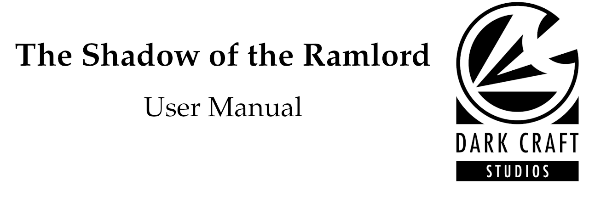

# Contents

* [Setup](#setup)
    * [Checking if your copy is up to date](#checking-if-your-copy-is-up-to-date)
    * [Installing the mod](#installing-sotr)

# Setup

In order to install and play The Shadow of the Ramlord (SOTR), you require the following:

- A copy of [Amnesia: The Dark Descent](http://amnesiagame.com/#main)

Your Amnesia installation also requires a specific version in order for SOTR to function properly.

## Checking if your copy is up to date

###  On Windows

* Make sure you have ran the game at least once before.

> After the first run of the game, Amnesia creates important configuration files that will allow you to verify wether or not your copy meets the requirement for SOTR to work as intended.

* The version of your game must be `1.4` or later.

To see which version of Amnesia you are running, navigate to the following directory:

```
My Documents/Amnesia/Main
```

If you ran Amnesia at least once, you should find a `hpl.log` file in this directory.

You can open this file in a text editor of your choice. (For example by dragging it into an open Notepad window)

The first line of this file is your game's version.

###  On Linux

* Make sure you have ran the game at least once before.

> After the first run of the game, Amnesia creates important configuration files that will allow you to verify wether or not your copy meets the requirement for SOTR to work as intended.

* The version of your game must be `1.4` or later.

To see which version of Amnesia you are running, navigate to the following directory:

```
~/.frictionalgames/Amnesia/Main
```

If you ran Amnesia at least once, you should find a `hpl.log` file in this directory.

You can open this file in a text editor of your choice.

The first line of this file is your game's version.

## Installing SOTR

###  On Windows

On Windows, there are two ways of installing SOTR.

* Using the installer

The recommended way of installing SOTR is using our installer program.

> The installer will attempt to locate your copy of Amnesia. If it finds more than one, it will let you decide which one to use.

>If the installer fails to locate a copy, you will be prompted to select the path to your game manually.

If you downloaded the installer package, you first need to unzip the installer itself.

Should you need help with unzipping the package, see the `To unzip (extract) files...` section of this [MS support article](https://support.microsoft.com/en-us/help/14200/windows-compress-uncompress-zip-files).

* Manual installation

When manually installing SOTR, you will download a `.zip` file containing the full custom story.

In order to install it, you need to unzip the contained `shadow-of-the-ramlord` folder into your Amnesia's `custom_stories` directory.

Where your Amnesia is installed depends on where you purchased your copy. For example **Steam** usually installs Amnesia into `[YourDrive]/Program Files (x86)/Steam/steamapps/common/Amnesia The Dark Descent`

###  On Linux

On Linux, the only method of installation is manual.

Inside the `.zip` file you downloaded, is the full custom story. In order to install it, you need to place the `shadow-of-the-ramlord` folder inside your Amnesia's `custom_stories` folder.

If you purchased Amnesia through steam, the path to your `custom_stories` folder usually is: `~/.steam/steam/steamapps/common/Amnesia The Dark Descent/custom_stories`.

# Starting SOTR

After you installed SOTR into your game, just run it and select the `Custom Stories` option from the main menu.

You should see the mod listed there.

# Questions & Answers

------
**What kind of mod is this?**

SOTR is mainly a mod that tries to tell a story. Don't expect too much action. Slow and deliberate players will be rewarded with a chilling story.

------
**Why does your code look so weird?**

SOTR uses a Preprocessor to compile our source code into something Amnesia understands. To see the original source code, visit our [Repository](https://dev.azure.com/dark-craft-studios/_git/shadow-of-the-ramlord?path=%2Fsource&version=GBmaster).

------
